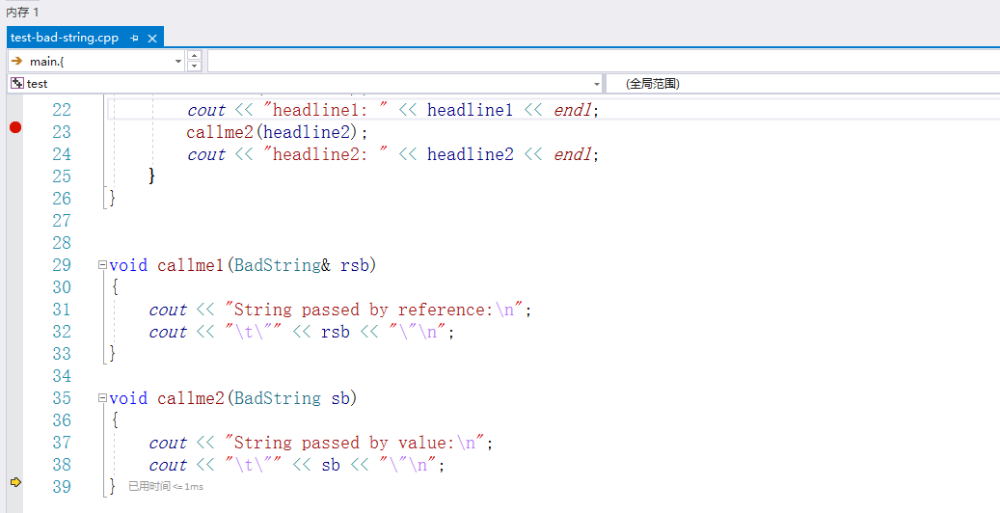
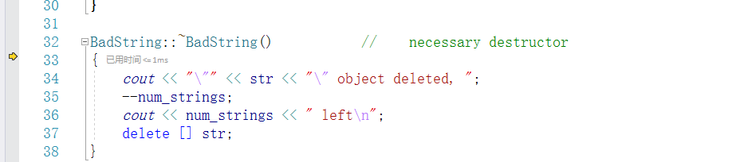
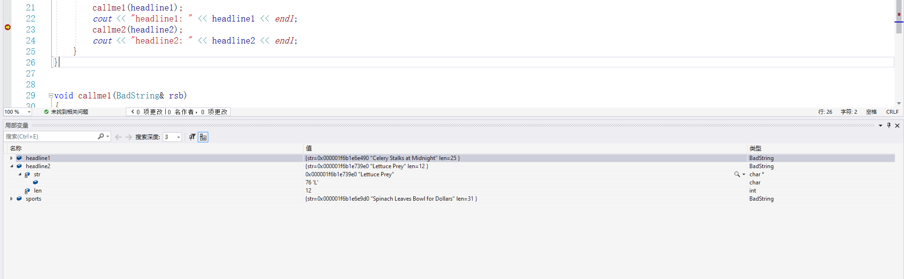
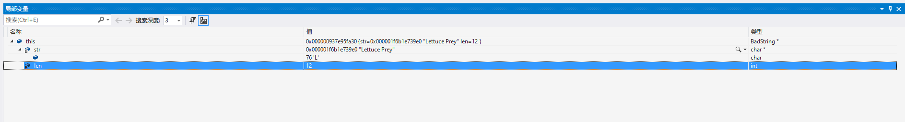

## step one
第一阶段可以看出，显示初始化函数与析构函数都没有问题.
- demostration
  

## step two
- main函数调用了callme1函数------callme1(BadString& rsb)
  - 传入参数headline1，程序将会进行------BadString& rsb = headline1
    其中headline1是一个lvalue，使用左值引用是没有什么问题的。
  - 程序完成赋值后，将会进入callme1函数内部，并且执行内部代码。------cout << rsb  ===>  cout << headline1
    程序将会匹配到友元函数，并且执行operator<<(const std::ostream& os, const BadString& st),此时cout与rsb(headline1)都是lvalue，所以使用const左值引用也没有问题。
  - callme1函数执行完毕后，会释放rsb的内存，也没有什么问题。

- run callme2
  - argument list(headline2 ---> BadString sb) == BadString sb(headline2)
    注意：此时程序调用的是BadString sb(headline2)，也就是BadString到BadString的复制构造函数。但是在我们自定义的类中，并没有显式的提供类的复制构造函数。**此时，编译器就会自动提供一个浅复制构造函数**，这个浅复制构造函数将会实现作用如下：
    ```c++{.line-numbers}
    sb.str = headline2.str;
    sb.len = headline2.len;
    ```
    其中，因为num_strings是类静态成员，编译器不会复制它的值。同样编译器也不知道应该将num_strings的值自增。
  - run callme2 function
    此时，sb打印的内容同样和headline2一样。
  - quit callme2 function
    编译器将会释放sb，因为sb的类型是BadString，所以会调用BadString类的析构函数。delete操作符去删除了sb和headline2同样的str存储空间。此时在主函数中再显示headline2，因为其str存储空间已经被释放，所以显示的内容是未定义的。

  - msvc demostration
    
    我在callme2函数出打了断点，并且成功运行callme2到结束。
    
    可以看到结束函数callme2后，程序调用了析构函数来释放callme2中的sb临时变量。
    
    上述是headline2的相关信息
    
    上述是callme2中临时变量sb的信息

    - 总结
      可以看到，headline2与callme2中的sb的str地址是同一地址，但是str被程序在callme2结束时的析构函数给释放了，导致程序返回主函数后，再次读取headline2中的str地址将会读到乱码信息。
      